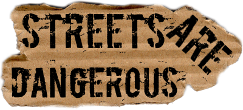

# Streets Are Dangerous

**DISCLAIMER:**

This code was written back in 2011. It's old, dirty and, overall, pretty bad.

As many years passed, this code only represents a fun exercise of the programmer I was back then.

I think I uploaded the project to remind me about the nights coding rather than impress someone...!

Code comments are in italian. Planning to translate them as soon as possible.

If you want to play it, it's still out in the [Windows Phone Marketplace](https://www.microsoft.com/en-us/store/apps/streets-are-dangerous/9nblggh099sx).

## Index

- [Story of the game and development](#story)
- [Description](#description)
- [Credits](#credits)
- [Screenshots](#screens)

###  Story of the game and development

This is Streets Are Dangerous, a small and silly game that I made some years ago.

It was just me exploring 3D graphics, XNA and smartphone development for the first time, so I decided to make a game out of it. It was a side project while writing another game with some friends, that never made it.

Being a student of a Disney artist in an art academy, I decided to follow the path of the foolish cartoon-like style. I drawed, did clanup and inked every drawing in the game, by hand.

I also modeled and textured with Blender the models.

Most of the development was done at night, staying up until 2-3am after finishing university assignments.

The game, by the way, is not finished. I had plans to add a lot of other features, and there are hints of this in the code.
I wanted to implement multiple difficulties, more obstacles, an online leaderboard, different roads...

Eventually, Windows Phone 7 was dropped by Microsoft not long after I started working on new features. SDK changed a lot after WP8 upgrade, XNA support was abandoned, with better and supported apps incoming. And... I kinda gave up.

Why cardboard? It gave me the "right" excuse for having the very simple 3D models you see in the game, as I'm no expert in that field.
Also, I just had plenty in my house, and in the end, looked cool!

###  Description

Streets Are Dangerous is an infinite 3D runner game. Your only goal is to resist as much as possible running at high speed, avoiding collision with obstacles.

After 10 consecutive hits with an obstacle, the game will be over. But even if you manage to avoid all of them, you need to pick up the lightning bolts, or you'll gradually lose speed to the point of stopping, ending the match.

The street in the game is made up by sections: every section spawns enemies and powerups in random positions.
The number of enemies increases with time, calculated with a square-root function.

Enemies can collide with each other, disappearing from the map and giving the player a huge help.

The dogs, the only moving enemies in the first version of the game, "jump" thanks to a very simple implementation of Bezier curves I made.
Once a "jump" is completed, they randomly select a new point in the section, jumping once again.

Also, dogs bark. Yeah. Every now and then (also random) they emit a 3D sound from the position they currently are (with headphones is better!), selecting a random pitch value.

Did I also mention that I like to randomize stuff?

###  Credits

Pretty much everything you see in the game is made by me: code, drawings, paper scans (what i remember most of the development of this game is me in a dark room cutting and scanning empty pieces of cardboard asking myself "am I really doing this?").

The only things I asked someone for help are:
 - Original Music: my sister, Chiara Nada
 - Sounds: [freesound.org](https://www.freesound.org/)
 - [Fontsquirrel](http://www.fontsquirrel.com/) for the free Andy font.

###  Screenshots

Someone also made a [video](https://www.youtube.com/watch?v=mBMqRwS2agg)! Still not understanding a single word.

